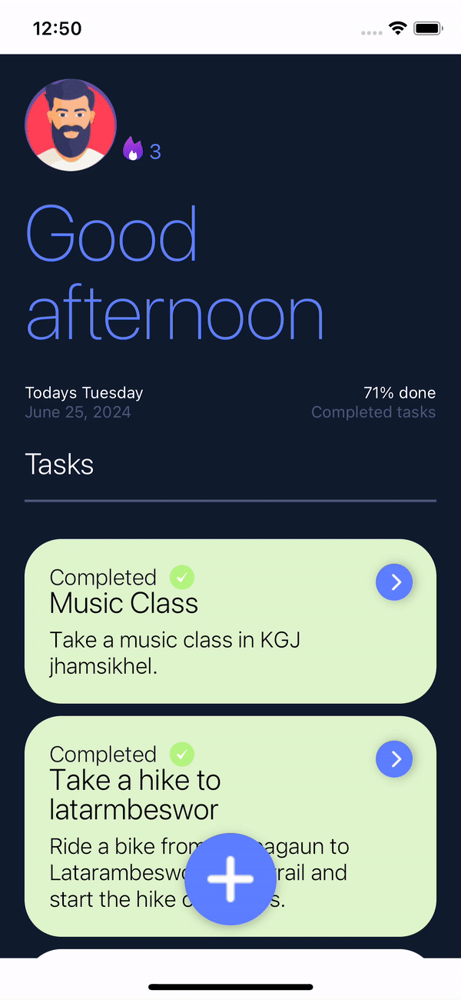
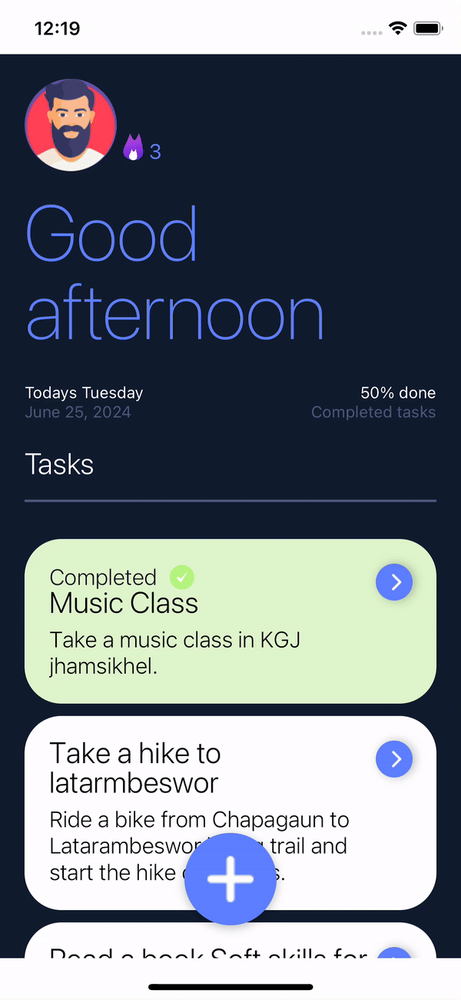

<!-- Table of Contents -->
<details>
  <summary>Table of Contents</summary>
  <ol>
    <li><a href="#built-with">Built With</a></li>
    <li>
      <a href="#getting-started">Getting Started</a>
      <ul>
        <li><a href="#install-dependencies">Install Dependencies</a></li>
        <li><a href="#start-metro">Start Metro</a></li>
      </ul>
    </li>
    <li><a href="#demo">Demo</a></li>
  </ol>
</details>

### Built With
 
This project is built with React Native and React Native web.

[![Expo][Expo]][Expo - url]
[![React Native][React Native]][React Native-url]

# Getting Started

>**Note**: Make sure you have completed the [Expo - Environment Setup]
<p><a href="https://docs.expo.dev/get-started/set-up-your-environment">Expo Environment setup</a></p>

# Running Project

## Navigate to Project

```bash
cd /path/to/project
```

## Open IDE
This command will open vs code.
```bash
code .
```

## Install Dependencies

```bash
# using npm
npm install
```

```bash
# OR using Yarn
yarn install
```

```bash
# OR using Expo
npx expo install
```

## Start Packager

```bash
# using npm
npm start
```

```bash
# OR using Yarn
yarn start
```

## Run on device
Iphone
```bash
# Press i
i
```
Android
```bash
# Press a
a
```
Web
```bash
# Press w
w
```
This wil install Expo go in native device and app will run.

# Demo
## Adding Task
1. Click on Plus Button
2. Add Title and Description
3. Click on Save Button



## Completing Task
1. Click on task
2. Click on Complete task 
Complete task button will be visible



## Deleting Task
1. Click on task
2. Click on Trash button
3. Confirm deletion


<!-- MARKDOWN LINKS & IMAGES -->
<!-- https://www.markdownguide.org/basic-syntax/#reference-style-links -->
[Expo]: https://img.shields.io/badge/Expo-20232A?style=for-the-badge&logo=expo&logoColor=61DAFBß
[Expo - url]: https://expo.dev/
[React Native]: https://img.shields.io/badge/React_Native-20232A?style=for-the-badge&logo=react&logoColor=61DAFBß
[React Native-url]: https://reactnative.dev/
